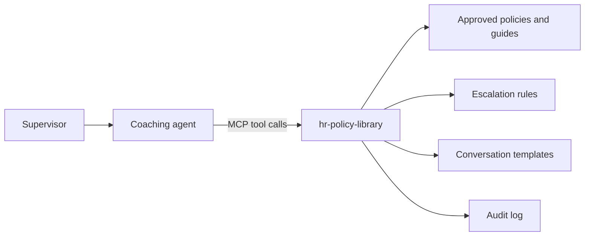

# hr-policy-library

A read-only [Model Context Protocol](https://modelcontextprotocol.io) (MCP) server that gives an AI coaching agent grounded access to approved HR policies, escalation rules, and conversation templates.

It was designed for an HR Supervisor Coaching agent: frontline supervisors practice difficult conversations, get coaching language they can adapt, and are routed to HR when a situation needs it. The agent can only answer from content HR has approved, and the connection itself enforces that boundary.

> **Note:** The `content/` folder contains sanitized sample documents for demonstration and testing. It does not contain real policies. 

Replace it with your own approved content, stored outside this repository.

## Why this exists

An HR coaching assistant is only as trustworthy as the content behind it. This server puts the guardrails in the data layer rather than relying on the prompt alone:

- The agent can read approved content and nothing else.
- Every answer can be traced to a document, version, and effective date.
- When nothing approved matches, the server says so and the agent is told to send the supervisor to HR.
- Employee-specific details are kept out of the flow.

## How it works



## Tools

| Tool | Purpose |
|---|---|
| `search_policies(query, topic?, audience?)` | Finds relevant passages in approved policies and manager guides. Returns cited results. |
| `get_policy(policy_id, section?)` | Returns the full text of one policy, or a single section. |
| `get_escalation_rule(scenario_type)` | Returns the trigger conditions, who to contact, and the required timing. Call with an empty value to list available scenario types. |
| `get_conversation_template(topic, audience?)` | Returns approved talking points, opening language, and documentation formats to adapt. |

Every result includes the source title, version, effective date, and link. Results also carry a `review_overdue` flag when a document is past its review date.

## Guardrails built into the server

- **Read-only.** No tool writes, deletes, or calls another system.
- **Approved content only.** A document loads only if it has `approved_for_ai: true` and `sensitivity: general`, plus an id, title, version, and effective date. Anything else is skipped at startup.
- **No answer without a source.** Weak or missing matches return `found: false` with an instruction not to answer from general knowledge.
- **Personal data check.** Queries containing emails, phone numbers, SSN-like numbers, or employee IDs are rejected with a request to rewrite them as a generic scenario.
- **Structured escalation.** Escalation rules are stored as data (triggers, contact, timing), so HR escalation is consistent and not left to the model's judgment.
- **Audit log.** Each tool call is written to a JSONL log with a timestamp, tool, arguments, and the document IDs returned.

These controls support, but do not replace, human review. The intended agent has no authority over disciplinary decisions, and HR review remains required for employee-relations decisions.

## Quick start

Requires Python 3.10 or later.

```bash
git clone https://github.com/elyse-deq/hr-policy-library.git
cd hr-policy-library
python -m venv .venv
source .venv/bin/activate        # Windows: .venv\Scripts\activate
pip install -r requirements.txt
python server.py                 # runs over stdio
```

Try the tools interactively with the MCP Inspector:

```bash
npx @modelcontextprotocol/inspector python server.py
```

### Connect to a desktop MCP client (stdio)

```json
{
  "mcpServers": {
    "hr-policy-library": {
      "command": "/absolute/path/to/.venv/bin/python",
      "args": ["/absolute/path/to/server.py"]
    }
  }
}
```

### Run as a hosted server (Streamable HTTP)

```bash
MCP_TRANSPORT=streamable-http MCP_HOST=0.0.0.0 MCP_PORT=8000 python server.py
```

The endpoint is served at `/mcp`. This server has no built-in authentication, so run it behind a gateway or reverse proxy that provides TLS and authentication (OAuth or a managed secret) before connecting it to an agent platform. Do not expose it publicly without authentication.

## Adding your content

```
content/
  policies/*.md            policies and manager guides
  templates/*.md           conversation templates
  escalation_rules.json    structured escalation rules
  synonyms.json            search synonyms maintained by HR
```

Each markdown file starts with front matter:

```markdown
---
id: POL-ATT-001
title: Attendance and Punctuality Policy
owner: HR Policy Team
version: "2.1"
effective_date: "2026-01-01"
review_date: "2027-01-01"
topics: [attendance]
audience: [supervisor, manager]
approved_for_ai: true
sensitivity: general
source_url: https://example.com/policies/attendance
---

## Section heading
Section text...
```

- Use `##` headings. Each section becomes one searchable passage.
- Quote any title that contains a colon.
- Escalation rules follow the format in `content/escalation_rules.json`. Only entries with `approved_for_ai: true` are loaded.
- `synonyms.json` maps everyday wording to policy wording (for example "arguing" to "conflict"). Add terms as you learn how supervisors phrase questions.

### Keep real content out of GitHub

Store approved HR content in a private location outside this repository and point the server at it:

```bash
export HR_CONTENT_DIR=/secure/path/to/approved-hr-content
```

The `.gitignore` excludes `.env`, `*.jsonl` audit logs, and a `content-private/` folder. Audit logs can contain query text, so never commit them.

## Configuration

| Variable | Default | Purpose |
|---|---|---|
| `HR_CONTENT_DIR` | `./content` | Location of approved content |
| `HR_AUDIT_LOG` | `./audit.jsonl` | Tool-call log path |
| `HR_LOG_QUERY_TEXT` | `true` | Set to `false` to log tool names and document IDs only |
| `HR_MIN_RELEVANCE` | `0.3` | Minimum match score for a result |
| `HR_MIN_TERM_COVERAGE` | `0.33` | Share of query terms a passage must match |
| `MCP_TRANSPORT` | `stdio` | `stdio` or `streamable-http` |
| `MCP_HOST` / `MCP_PORT` | `127.0.0.1` / `8000` | Bind address for HTTP transport |

See `.env.example` for a template.

## Testing

```bash
pip install -r requirements-dev.txt
python -m pytest -q
```

The tests cover cited results, synonym matching, no-source responses, personal-data rejection, topic filtering, escalation rules, and templates. GitHub Actions runs them on every push.

Before a pilot, also build an evaluation set of realistic supervisor questions: standard scenarios, escalation triggers, out-of-scope requests (such as asking the agent to decide discipline), and topics the content does not cover. Use it to tune the two relevance settings above.

## Known limitations

- **Keyword search.** Search uses BM25-style ranking with light stemming and synonyms, not embeddings. It is transparent and easy to audit, but it can miss unusual phrasing. If an evaluation shows too many misses, replace the `bm25_rank` function with embedding or hybrid search. The tool signatures and return format stay the same.
- **No built-in authentication.** Authentication and TLS belong in the deployment layer.
- **Content is loaded at startup.** Restart the server after content changes.
- **SDK version.** Pinned to `mcp<2` because the 2.x SDK renamed `FastMCP`.

## Roadmap

- A companion server for learning and coaching resources (`search_guides`, `get_guide`, `get_documentation_template`)
- Optional embedding or hybrid retrieval
- Content hot-reload
- Built-in authentication for the HTTP transport

## Project structure

```
server.py                    MCP server and tools
content/                     Sample content (fictional)
tests/                       Behavior tests
.env.example                 Configuration template
.github/workflows/tests.yml  CI
```

## Disclaimer

This project is a technical pattern for grounded, guarded AI assistance. It is not legal or HR advice. Organizations are responsible for the accuracy of their own policy content and for HR and Legal review before deploying any assistant to employees.
