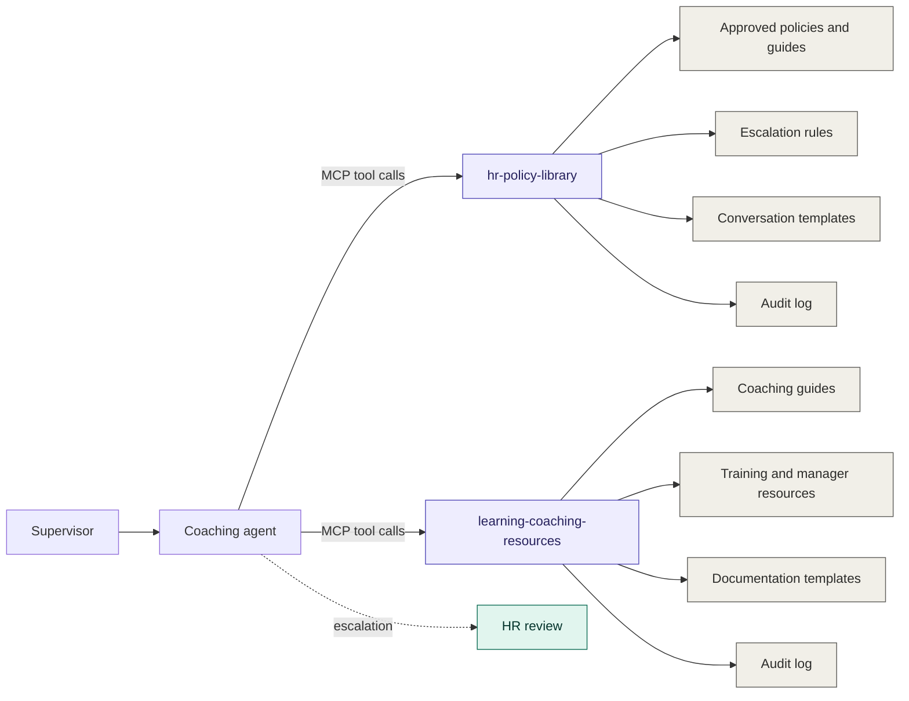
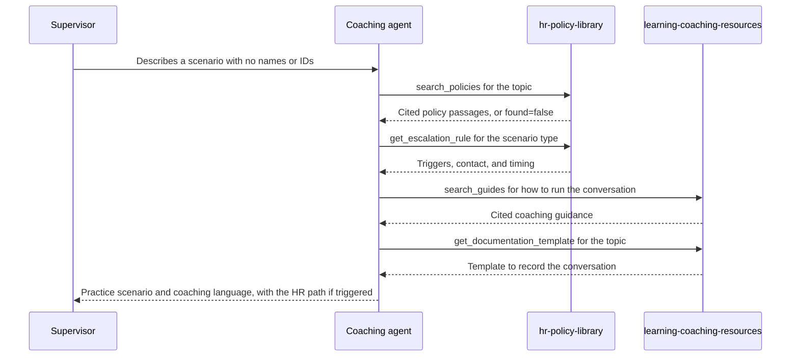

# HR Supervisor Coaching

Two read-only [Model Context Protocol](https://modelcontextprotocol.io) (MCP) servers that give an AI coaching agent grounded access to approved HR content. Frontline supervisors practice difficult conversations, get coaching language they can adapt, and are routed to HR when a situation needs it.

The agent can only answer from content that has been approved for AI use, and the connections themselves enforce that boundary.

> **Note:** Both servers ship with sanitized sample content for demonstration and testing. It does not contain real policies or training material.

## Architecture



## The two servers

| Server | Answers | Tools |
| --- | --- | --- |
| [`hr-policy-library`](hr-policy-library) | What does policy say, and when must HR be involved? | `search_policies`, `get_policy`, `get_escalation_rule`, `get_conversation_template` |
| [`learning-coaching-resources`](learning-coaching-resources) | How do I hold the conversation, and how do I document it? | `search_guides`, `get_guide`, `get_documentation_template` |

Escalation decisions live only in `hr-policy-library`. The coaching guides point back to it, so there is one source of truth for when HR is required.

## How they work together



## Shared guardrails

- **Read-only.** No tool writes, deletes, or calls another system.
- **Approved content only.** Documents load only with `approved_for_ai: true` and `sensitivity: general`.
- **No answer without a source.** Weak or missing matches return `found: false`, and the agent is told to direct the supervisor to HR.
- **Personal data check.** Queries containing emails, phone numbers, SSN-like numbers, or employee IDs are rejected.
- **Cited and dated.** Every result carries the source title, version, effective date, link, and a review-overdue flag.
- **Audit log.** Each tool call is logged with the document IDs returned.
- **Human review stays in the loop.** The agent has no authority over disciplinary decisions, and HR review remains required for employee-relations decisions.

## Repository layout

```
hr-policy-library/              policies, escalation rules, conversation templates
learning-coaching-resources/    coaching guides, training, documentation templates
.github/workflows/tests.yml     CI for both servers
```

## Quick start

Each server is self-contained. Pick one, then follow its README.

```
git clone https://github.com/elyse-deq/HR-Supervisor-Coaching.git
cd HR-Supervisor-Coaching/hr-policy-library            # or learning-coaching-resources
python -m venv .venv && source .venv/bin/activate
pip install -r requirements-dev.txt
python -m pytest -q
python server.py
```

The servers use ports 8000 and 8001 by default for the HTTP transport, so they can run side by side.

## Portfolio

This repository accompanies the HR Supervisor Coaching work sample at [elysedequina.org/ai-agents-copilots](https://elysedequina.org/ai-agents-copilots).

## Disclaimer

This project is a technical pattern for grounded, guarded AI assistance. It is not legal or HR advice. Organizations are responsible for the accuracy of their own content and for HR and Legal review before deploying any assistant to employees.

## Author

Built by [Elyse](https://elysedequina.org/). GitHub: [@elyse-deq](https://github.com/elyse-deq)
