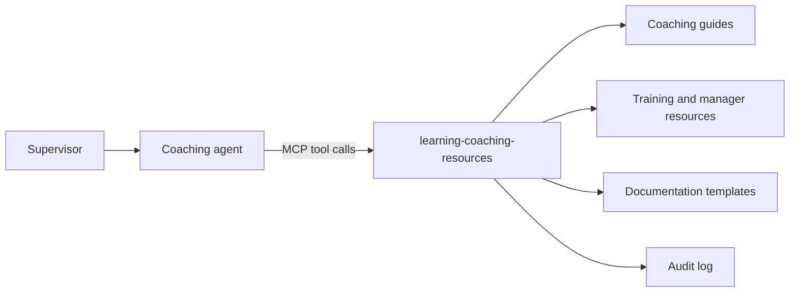

# learning-coaching-resources

A read-only [Model Context Protocol](https://modelcontextprotocol.io) (MCP) server that gives an AI coaching agent grounded access to approved coaching guides, training, manager resources, and documentation templates.

It is the companion to [`hr-policy-library`](../hr-policy-library). That server answers what policy says and when HR must be involved. This one answers how to hold the conversation and how to document it. Together they support an HR Supervisor Coaching agent: frontline supervisors practice difficult conversations, get coaching language they can adapt, and are routed to HR when a situation needs it.

> **Note:** The `content/` folder contains sanitized sample documents for demonstration and testing. It does not contain real training or HR material.

Replace it with your own approved content, stored outside this repository.

## Why this exists

Coaching guidance is only as trustworthy as the content behind it. This server puts the guardrails in the data layer rather than relying on the prompt alone:

- The agent can read approved content and nothing else.
- Every answer can be traced to a document, version, and effective date.
- When nothing approved matches, the server says so and the agent is told to send the supervisor to HR.
- Employee-specific details are kept out of the flow.
- Escalation decisions are not made here. Guides point back to `hr-policy-library`, so there is one source of truth for when HR is required.

## How it works



## Tools

| Tool | Purpose |
| --- | --- |
| `search_guides(query, topic?, audience?, category?)` | Finds relevant passages in approved guides, training, and manager resources. Returns cited results. |
| `get_guide(guide_id, section?)` | Returns the full text of one guide, or a single section. |
| `get_documentation_template(topic, audience?)` | Returns approved templates for recording a coaching conversation and its follow-up. |

Categories are `conversation-guide`, `training`, and `manager-resource`. Every result includes the source title, version, effective date, and link. Results also carry a `review_overdue` flag when a document is past its review date.

## Guardrails built into the server

- **Read-only.** No tool writes, deletes, or calls another system.
- **Approved content only.** A document loads only if it has `approved_for_ai: true` and `sensitivity: general`, plus an id, title, version, and effective date. Guides also need a valid `category`. Anything else is skipped at startup.
- **No answer without a source.** Weak or missing matches return `found: false` with an instruction not to answer from general knowledge.
- **Personal data check.** Queries containing emails, phone numbers, SSN-like numbers, or employee IDs are rejected with a request to rewrite them as a generic scenario.
- **No escalation decisions.** Guides list prompts to check, but whether HR is required comes from `get_escalation_rule` in `hr-policy-library`.
- **Audit log.** Each tool call is written to a JSONL log with a timestamp, tool, arguments, and the document IDs returned.

These controls support, but do not replace, human review. The intended agent has no authority over disciplinary decisions, and HR review remains required for employee-relations decisions.

## Quick start

Requires Python 3.10 or later.

```
git clone https://github.com/elyse-deq/HR-Supervisor-Coaching.git
cd HR-Supervisor-Coaching/learning-coaching-resources
python -m venv .venv
source .venv/bin/activate        # Windows: .venv\Scripts\activate
pip install -r requirements.txt
python server.py                 # runs over stdio
```

Try the tools interactively with the MCP Inspector:

```
npx @modelcontextprotocol/inspector python server.py
```

### Connect to a desktop MCP client (stdio)

```
{
  "mcpServers": {
    "learning-coaching-resources": {
      "command": "/absolute/path/to/.venv/bin/python",
      "args": ["/absolute/path/to/learning-coaching-resources/server.py"]
    }
  }
}
```

### Run as a hosted server (Streamable HTTP)

```
MCP_TRANSPORT=streamable-http MCP_HOST=0.0.0.0 MCP_PORT=8001 python server.py
```

The endpoint is served at `/mcp`. The default port is 8001 so it can run beside `hr-policy-library` on 8000. This server has no built-in authentication, so run it behind a gateway or reverse proxy that provides TLS and authentication before connecting it to an agent platform. Do not expose it publicly without authentication.

## Adding your content

```
content/
  guides/*.md              conversation guides, training, manager resources
  templates/*.md           documentation templates
  synonyms.json            search synonyms maintained by L&D
```

Each markdown file starts with front matter:

```
---
id: CG-ATT-001
title: "Coaching Guide: Attendance Conversation"
category: conversation-guide      # guides only
owner: Learning and Development
version: "1.0"
effective_date: "2026-01-01"
review_date: "2027-01-01"
topics: [attendance]
audience: [supervisor]
approved_for_ai: true
sensitivity: general
source_url: https://example.com/guides/attendance
---

## Section heading
Section text...
```

- Use `##` headings. Each section becomes one searchable passage.
- Quote any title that contains a colon.
- Write in the words supervisors use ("employee", "late", "arguing"). Search matches on wording, so content that avoids those terms will not be found.
- `synonyms.json` maps everyday wording to approved wording. Add terms as you learn how supervisors phrase questions.

### Keep real content out of GitHub

Store approved content in a private location outside this repository and point the server at it:

```
export LCR_CONTENT_DIR=/secure/path/to/approved-coaching-content
```

The `.gitignore` excludes `.env`, `*.jsonl` audit logs, and a `content-private/` folder. Audit logs can contain query text, so never commit them.

## Configuration

| Variable | Default | Purpose |
| --- | --- | --- |
| `LCR_CONTENT_DIR` | `./content` | Location of approved content |
| `LCR_AUDIT_LOG` | `./audit.jsonl` | Tool-call log path |
| `LCR_LOG_QUERY_TEXT` | `true` | Set to `false` to log tool names and document IDs only |
| `LCR_MIN_RELEVANCE` | `0.3` | Minimum match score for a result |
| `LCR_MIN_TERM_COVERAGE` | `0.33` | Share of query terms a passage must match |
| `MCP_TRANSPORT` | `stdio` | `stdio` or `streamable-http` |
| `MCP_HOST` / `MCP_PORT` | `127.0.0.1` / `8001` | Bind address for HTTP transport |

See `.env.example` for a template.

## Testing

```
pip install -r requirements-dev.txt
python -m pytest -q
```

The tests cover cited results, synonym matching, category and topic filters, no-source responses, personal-data rejection, unapproved and restricted content being skipped, the review-overdue flag, template separation, and audit redaction. GitHub Actions runs them on every push.

Before a pilot, also build an evaluation set of realistic supervisor questions: standard scenarios, out-of-scope requests, and topics the content does not cover. Use it to tune the two relevance settings above.

## Known limitations

- **Keyword search.** Search uses BM25-style ranking with light stemming and synonyms, not embeddings. It is transparent and easy to audit, but it can miss unusual phrasing. If an evaluation shows too many misses, replace the `bm25_rank` function with embedding or hybrid search. The tool signatures and return format stay the same.
- **No built-in authentication.** Authentication and TLS belong in the deployment layer.
- **Content is loaded at startup.** Restart the server after content changes.
- **SDK version.** Pinned to `mcp<2` because the 2.x SDK renamed `FastMCP`.
- **Shared code is duplicated.** Search and guardrail helpers are copied from `hr-policy-library` so each server stands alone. Factor them into a shared module if the project grows.

## Roadmap

- Optional embedding or hybrid retrieval
- Content hot-reload
- Built-in authentication for the HTTP transport

## Project structure

```
server.py                    MCP server and tools
content/                     Sample content (fictional)
tests/                       Behavior tests
.env.example                 Configuration template
```

## Disclaimer

This project is a technical pattern for grounded, guarded AI assistance. It is not legal or HR advice. Organizations are responsible for the accuracy of their own content and for HR and Legal review before deploying any assistant to employees.

## Author

Built by [Elyse](https://elysedequina.org/). GitHub: [@elyse-deq](https://github.com/elyse-deq)
